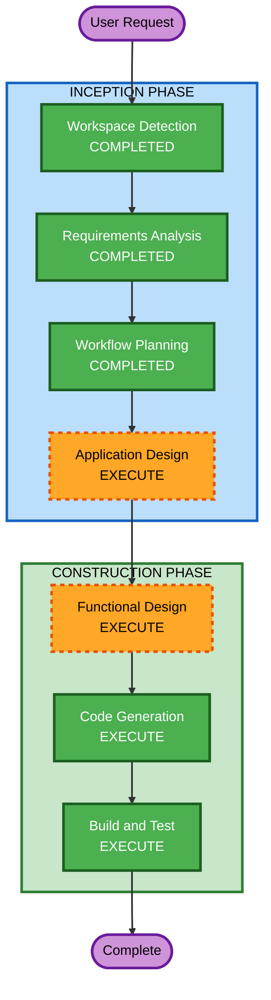

# Execution Plan

## Detailed Analysis Summary

### Change Impact Assessment
- **User-facing changes**: Yes — entirely new application with clinician-facing dashboard
- **Structural changes**: Yes — new multi-component system (frontend, backend, simulator)
- **Data model changes**: Yes — new in-memory data structures for patients, vitals, alerts
- **API changes**: Yes — new WebSocket and REST API endpoints
- **NFR impact**: Yes — real-time performance, WCAG 2.0 accessibility, healthcare UI standards

### Risk Assessment
- **Risk Level**: Low (PoC with no production dependencies, no persistence, no auth)
- **Rollback Complexity**: Easy (greenfield, no existing system affected)
- **Testing Complexity**: Moderate (real-time WebSocket, threshold logic, UI accessibility)

## Workflow Visualization



### Text Alternative
```
INCEPTION PHASE:
  1. Workspace Detection (COMPLETED)
  2. Requirements Analysis (COMPLETED)
  3. Workflow Planning (COMPLETED)
  4. Application Design (EXECUTE)

CONSTRUCTION PHASE:
  5. Functional Design (EXECUTE)
  6. Code Generation (EXECUTE)
  7. Build and Test (EXECUTE)
```

## Phases to Execute

### INCEPTION PHASE
- [x] Workspace Detection (COMPLETED)
- [x] Requirements Analysis (COMPLETED)
- [x] Workflow Planning (COMPLETED)
- [ ] Reverse Engineering - SKIP
  - **Rationale**: Greenfield project, no existing code to analyze
- [ ] User Stories - SKIP
  - **Rationale**: Single user type (clinician), clear requirements, PoC scope
- [ ] Application Design - EXECUTE
  - **Rationale**: New multi-component system needs component identification, service boundaries, and API contract definition
- [ ] Units Generation - SKIP
  - **Rationale**: Single unit of work — the entire PoC is small enough to implement as one cohesive unit

### CONSTRUCTION PHASE
- [ ] Functional Design - EXECUTE
  - **Rationale**: Threshold alerting logic, vital sign simulation algorithms, and alert state machine need detailed design
- [ ] NFR Requirements - SKIP
  - **Rationale**: NFRs are straightforward (WCAG 2.0, in-memory, local deployment) and already captured in requirements
- [ ] NFR Design - SKIP
  - **Rationale**: No complex NFR patterns needed for a local PoC
- [ ] Infrastructure Design - SKIP
  - **Rationale**: No cloud infrastructure; runs locally with no external dependencies
- [ ] Code Generation - EXECUTE (ALWAYS)
  - **Rationale**: Implementation planning and code generation needed
- [ ] Build and Test - EXECUTE (ALWAYS)
  - **Rationale**: Build verification and testing instructions needed

### OPERATIONS PHASE
- [ ] Operations - PLACEHOLDER
  - **Rationale**: Future deployment and monitoring workflows (not applicable for local PoC)

## Estimated Timeline
- **Total Stages to Execute**: 4 remaining (Application Design, Functional Design, Code Generation, Build and Test)
- **Total Stages to Skip**: 6 (Reverse Engineering, User Stories, Units Generation, NFR Requirements, NFR Design, Infrastructure Design)

## Success Criteria
- **Primary Goal**: Working PoC demonstrating real-time remote patient monitoring with simulated IoT devices
- **Key Deliverables**:
  - Python/FastAPI backend with WebSocket support
  - React frontend with WCAG 2.0 compliant dashboard
  - 10 simulated patients with 7 vital signs each
  - Threshold-based alerting with audio/visual notifications
  - Clinician alert acknowledgment workflow
- **Quality Gates**:
  - All vital signs update in real-time (5-second intervals)
  - Threshold breaches generate alerts within 1 second
  - UI meets WCAG 2.0 AA contrast requirements
  - Medical condition simulation buttons trigger appropriate vital changes
  - Alert acknowledgment with notes persists in session history
